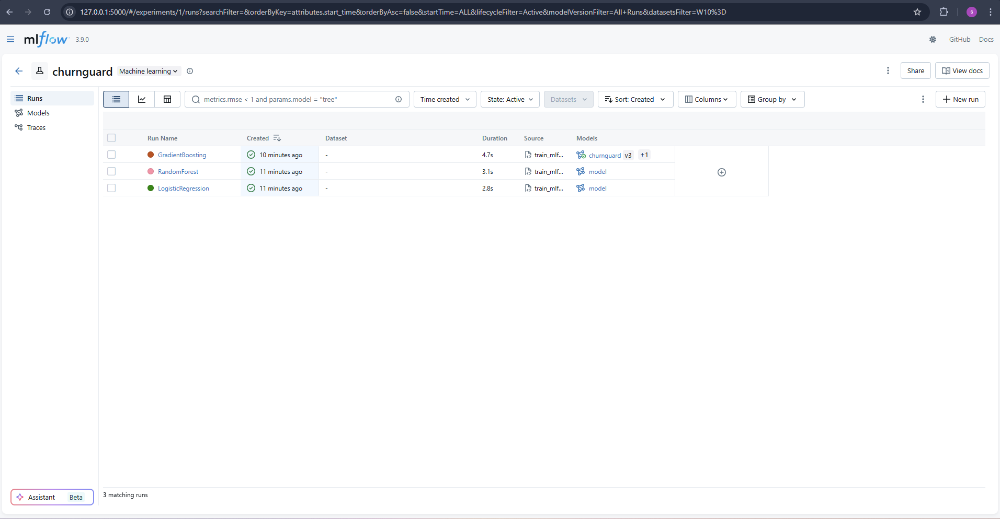
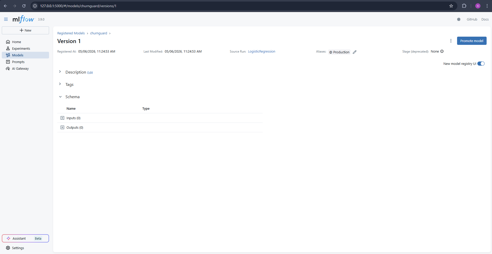

# ChurnGuard MLOps


API de prédiction de churn client — stack MLOps complète avec MLflow, FastAPI et Docker.

---

## Lancement rapide

```bash
git clone https://github.com/sofian-ras/ECF5_churnguard.git
cd ECF5_churnguard/repo_depart
docker compose up --build
```

C'est tout. Au premier démarrage :

1. Le serveur **MLflow** démarre sur le port 5000.
2. Le service **bootstrap** télécharge le dataset, entraîne 3 modèles (LogisticRegression, RandomForest, GradientBoosting), et promeut le meilleur en `Production` avec l'alias `champion`.
3. L'**API** démarre sur le port 8000 et charge le modèle depuis MLflow.

| Service | URL |
|---|---|
| API FastAPI | http://localhost:8000 |
| Documentation Swagger | http://localhost:8000/docs |
| MLflow UI | http://localhost:5000 |

---

## Architecture

```
docker compose up --build
│
├── mlflow  (port 5000)
│     └── stocke les runs, métriques et artefacts (SQLite + volume)
│
├── bootstrap  (s'arrête après init)
│     └── entraîne 3 modèles → promeut le meilleur en Production + alias "champion"
│
└── api  (port 8000)
      └── charge models:/churnguard/Production au démarrage
```

---

## Endpoints API

### `GET /health`

```bash
curl http://localhost:8000/health
```

```json
{"status": "ok", "model": "churnguard", "version": "1"}
```

### `POST /predict`

```bash
curl -X POST http://localhost:8000/predict \
  -H "Content-Type: application/json" \
  -d '{
    "gender": "Male",
    "SeniorCitizen": 0,
    "Partner": "Yes",
    "Dependents": "No",
    "tenure": 12,
    "PhoneService": "Yes",
    "MultipleLines": "No",
    "InternetService": "DSL",
    "OnlineSecurity": "No",
    "OnlineBackup": "Yes",
    "DeviceProtection": "No",
    "TechSupport": "No",
    "StreamingTV": "No",
    "StreamingMovies": "No",
    "Contract": "Month-to-month",
    "PaperlessBilling": "Yes",
    "PaymentMethod": "Electronic check",
    "MonthlyCharges": 29.85,
    "TotalCharges": 358.20
  }'
```

```json
{"churn": false, "probability": 0.35}
```

### `POST /predict/batch` (max 100 clients)

```bash
curl -X POST http://localhost:8000/predict/batch \
  -H "Content-Type: application/json" \
  -d '[
    {"gender":"Male","SeniorCitizen":0,"Partner":"Yes","Dependents":"No","tenure":12,"PhoneService":"Yes","MultipleLines":"No","InternetService":"DSL","OnlineSecurity":"No","OnlineBackup":"Yes","DeviceProtection":"No","TechSupport":"No","StreamingTV":"No","StreamingMovies":"No","Contract":"Month-to-month","PaperlessBilling":"Yes","PaymentMethod":"Electronic check","MonthlyCharges":29.85,"TotalCharges":358.20},
    {"gender":"Female","SeniorCitizen":1,"Partner":"No","Dependents":"No","tenure":2,"PhoneService":"Yes","MultipleLines":"No","InternetService":"Fiber optic","OnlineSecurity":"No","OnlineBackup":"No","DeviceProtection":"No","TechSupport":"No","StreamingTV":"Yes","StreamingMovies":"Yes","Contract":"Month-to-month","PaperlessBilling":"Yes","PaymentMethod":"Electronic check","MonthlyCharges":85.0,"TotalCharges":170.0}
  ]'
```

```json
[{"churn": false, "probability": 0.01}, {"churn": true, "probability": 0.82}]
```

---

## MLflow

Ouvrir http://localhost:5000 pour accéder à l'UI.

- **Expérience** : `churnguard` — 3 runs loggés (accuracy, precision, recall, f1, roc_auc)
- **Registry** : modèle `churnguard` version 1, stage `Production`, alias `champion`




---

## Tests

```bash
cd repo_depart
pip install -e ".[dev]"
pytest tests/ --cov=churnguard --cov-fail-under=70 -v
```

8 tests — coverage 79 % (seuil requis : 70 %).

---

## CI / CD

- **CI** (`.github/workflows/ci.yml`) : lint ruff, typecheck mypy, tests pytest, build Docker + scan Trivy — déclenché sur chaque push.
- **CD** (`.github/workflows/release.yml`) : build + push image sur `ghcr.io` — déclenché sur tag `v*.*.*`.

```bash
# Publier une release
git tag v1.0.0 && git push origin v1.0.0
```

Image publique :

```bash
docker pull ghcr.io/sofian-ras/churnguard:v1.0.0
```

---

## Structure du projet

```
repo_depart/
├── churnguard/          # package Python (data, train, evaluate)
├── api/                 # FastAPI (main.py)
├── scripts/             # bootstrap_model.py, train_mlflow.py
├── tests/               # 8 tests pytest
├── Dockerfile           # multi-stage : builder → api / venv-bootstrap → bootstrap
├── docker-compose.yml   # mlflow + bootstrap + api
└── monitoring/          # drift Evidently (bonus)
```

---

## Bonus implémentés

- Healthcheck Docker actif sur `mlflow` et `api`
- Utilisateur non-root dans le conteneur API
- Image API < 500 Mo (`docker images repo_depart-api`)
- Alias MLflow `champion` sur la version Production
- Monitoring drift : `python monitoring/drift.py`
- Manifests Kubernetes dans `../k8s/`
- Notification Slack sur échec CI (`SLACK_WEBHOOK_URL` à configurer dans les secrets GitHub)
- Release notes automatiques sur tag `v*.*.*`

---

## Conformité RGPD

Voir [RGPD.md](RGPD.md) — finalités du traitement, base légale, droits des personnes, mesures techniques implémentées.
